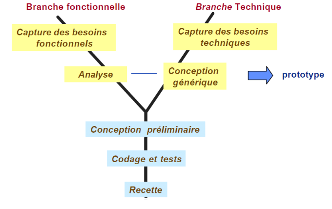

# Chapitre 1 : 2tup

dans cette chapitre nous allons voir methode 2tup qui est une methode de conception de projet qui permet de concevoir et structurer une base de données pour un blog simple avec Laravel, incluant les entités de base (articles, catégories, utilisateurs) et les relations nécessaires pour faciliter l’organisation du contenu.

