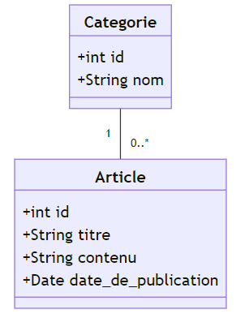

# Chapitre 4 : Branche technique
## 1. Analyse technique

### Objectif
Évaluer la faisabilité technique du projet, étudier les technologies disponibles, et planifier l'architecture technique.
- **Thechnologies** : Les technologies à utiliser pour le projet : 

## 2. Prototype
### Objectif
Développer et tester le prototype du projet.

- **Conception générique** : Concevoir une vue d'ensemble de la solution.

